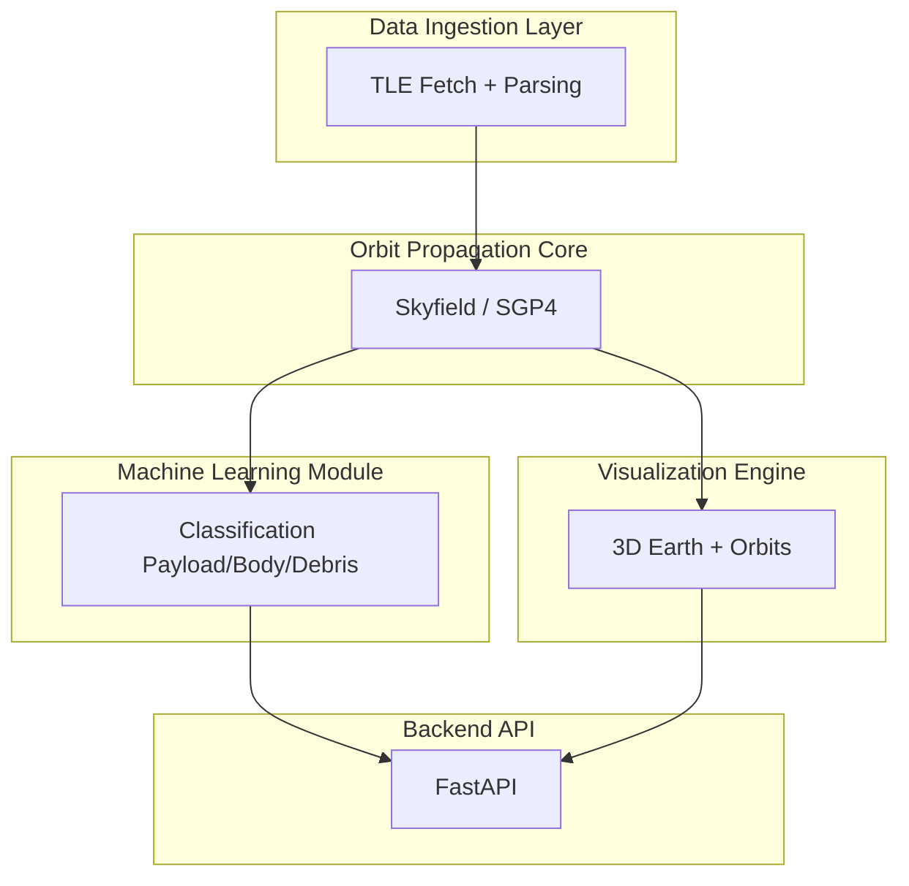

# 🛰️ Space Debris Tracking System

[](https://opensource.org/licenses/MIT)
[](https://www.python.org/downloads/)
[](https://github.com/psf/black)

A machine-learning-enhanced computational tool for tracking, propagating, and visualizing orbital debris using real astrodynamics data. Designed with a research-style scientific structure inspired by modern Space Situational Awareness (SSA) practices.

## 📌 Table of Contents

- [Overview](#overview)
- [Scientific Motivation](#scientific-motivation)
- [Key Features](#key-features)
- [System Architecture](#system-architecture)
- [Project Structure](#project-structure)
- [Installation](#installation)
- [Configuration](#configuration)
- [Running the Project](#running-the-project)
- [Usage Examples](#usage-examples)
- [Machine Learning Component](#machine-learning-component)
- [Technologies Used](#technologies-used)
- [Roadmap](#roadmap)
- [Testing](#testing)
- [Contributing](#contributing)
- [References](#references)
- [Acknowledgements](#acknowledgements)
- [License](#license)

## Overview

The Space Debris Tracking System is a modular Python-based toolkit capable of:

- Fetching and parsing real orbital datasets such as TLEs
- Propagating satellite and debris orbits
- Classifying objects using ML models
- Producing 3D visualizations of Earth and orbital tracks
- Exposing a backend API for dashboards and external applications

Although developed within an engineering context, the design style aligns closely with scientific computing and astrophysics toolkits.

## Scientific Motivation

The density of space debris continues to increase due to:

- Large satellite deployments
- Fragmentation events
- Retired spacecraft
- Rocket bodies left in orbit

This creates measurable risks including:

- Collision cascades (Kessler Syndrome)
- Threats to commercial and scientific missions
- Difficulty in long-term orbital sustainability

The purpose of this project is to explore computational astrodynamics, machine learning, and visualization techniques that help understand and model orbital environments at an academic level.

## Key Features

- **Orbital Data Ingestion**: Support for TLE sources such as CelesTrak, with parsing and validation utilities.
- **Orbit Propagation**: High-precision propagation using Skyfield/SGP4.
- **Machine Learning Classification**: Pretrained scikit-learn models for classifying objects into: payload, rocket body, debris.
- **3D Earth & Orbit Visualization**: Render orbits with PyVista or similar libraries.
- **REST API Backend**: FastAPI-powered backend enabling external access to propagation, classification, and data services.
- **Extensible Modular Design**: Organized into clear layers: orbit mechanics, ML, visualization, and API.

## System Architecture



## Project Structure

```text
space-debris-tracker/
├─ pyproject.toml              # Project metadata & dependencies (Python 3.11)
├─ requirements.txt            # Pinned dependencies
├─ README.md                   # You are here
│
├─ assets/
│  ├─ models/
│  │  ├─ earth/
│  │  │   earth.glb
│  │  │   earth.mtl
│  │  │   earth.obj
│  │  └─ satellites/
│  │      Hubble Space Telescope (A).glb
│  │      International Space Station (ISS) (A).glb
│  └─ textures/
│      clouds.png
│      earth_day.jpg
│
├─ backend/
│  ├─ .env                     # NASA API key, config (not committed to GitHub)
│  ├─ __init__.py              # Makes `backend` a package
│  ├─ main.py                  # Main entry: python -m backend.main
│  ├─ build_dataset.py         # Build CSV dataset from TLEs
│  ├─ check_dataset.py         # Quick sanity checks on CSV
│  ├─ collision_checker.py     # Close-approach detection
│  ├─ config.py                # Central config (paths, thresholds, API base URLs)
│  ├─ nasa_client.py           # NASA API access helpers
│  ├─ orbit_plotter.py         # 3D PyVista orbit visualization
│  ├─ orbit_predictor.py       # Time-step prediction of orbits from TLE
│  ├─ test_utils_temp.py       # Temporary/manual test helpers
│  ├─ tle_fetcher.py           # Fetches and stores TLE files
│  ├─ train_model.py           # Trains ML classifier from features CSV
│  ├─ utils.py                 # Common utilities (time, distance, ML colors, etc.)
│  ├─ visualizer.py            # 2D Cartopy visualizations (static + animated)
│  │
│  ├─ scripts/
│  │  ├─ health_check.py       # Basic project health checks
│  │  ├─ run_health.ps1        # PowerShell runner for health_check
│  │  ├─ test_nasa_client.py   # Test NASA connectivity & responses
│  │  ├─ test_tle_fetch.py     # Quick TLE fetch tests
│  │  ├─ verify_cleanup.py     # Sanity check for generated files
│  │  └─ _init_.py             # (typo; should be __init__.py if used as package)
│  │
│  ├─ utils/
│  │  └─ _init_.py             # (placeholder for future shared utilities)
│  └─ __pycache__/             # Python cache (ignored by git)
│
├─ data/
│  ├─ latest_tle.txt           # Last downloaded TLE snapshot
│  ├─ tle_features_all.csv     # Extracted features for many objects
│  ├─ tle_features_labeled.csv # Labeled feature dataset (for ML training)
│  │
│  ├─ famous_tles/
│  │  └─ famous.txt            # TLEs for selected famous satellites (ISS, Hubble…)
│  └─ tle/
│     └─ active/
│         YYYYMMDD_HHMMSS.tle  # Historical TLE snapshots
│
├─ ml_models/
│  └─ object_classifier.joblib # Trained RandomForest classifier
│
├─ models/
│  ├─ iss.obj
│  └─ iss.mtl                  # Standalone ISS model (legacy)
│
├─ screenshots/
│  └─ orbit_view_*.png         # Saved PyVista 3D orbit screenshots
│
├─ tests/
│  ├─ sample.tle
│  ├─ test_orbit_predictor.py  # Unit tests for orbit time-steps
│  └─ test_time_steps.py       # Additional time-step logic tests
│
└─ tools/
   └─ fix_backend_imports.py   # Helper script for import path cleanup
```

## Installation

### Clone the Repository

```bash
git clone https://github.com/fenilmodi823/space-debris-tracker.git
cd space-debris-tracker
```

### Create a Virtual Environment

```bash
python -m venv .venv
```

**Activate:**

- Windows:
  ```powershell
  .venv\Scripts\activate
  ```
- Linux/macOS:
  ```bash
  source .venv/bin/activate
  ```

### Install Dependencies

```bash
pip install --upgrade pip
pip install -r requirements.txt
```

## Configuration

Create a `.env` file based on `.env.example`.

**Example:**

```ini
NASA_API_KEY=your_api_key_here
DATA_SOURCE_URL=https://celestrak.org/NORAD/elements/gp.php?CATNR=
LOG_LEVEL=INFO
```

## Running the Project

### Start the API

```bash
uvicorn backend.main:app --reload
```

**Visit:**

- Swagger UI: [http://127.0.0.1:8000/docs](http://127.0.0.1:8000/docs)
- ReDoc (if enabled): [http://127.0.0.1:8000/redoc](http://127.0.0.1:8000/redoc)

## Usage Examples

### Propagate an Object

```bash
curl "http://127.0.0.1:8000/propagate?norad_id=25544&minutes=120"
```

### Python Orbit Propagation

```python
from backend.orbit.propagation import propagate_tle
from datetime import datetime, timedelta

positions = propagate_tle(tle_line1, tle_line2, datetime.utcnow(), datetime.utcnow() + timedelta(minutes=90))
for t, (x,y,z) in positions:
    print(t, x, y, z)
```

### Classify an Object

```python
from backend.ml.classifier import classify_object

features = {
    "semi_major_axis": 6780.0,
    "eccentricity": 0.0005,
    "inclination": 51.6,
    "period_minutes": 92.6
}

print(classify_object(features))
```

## Machine Learning Component

- **Model Type**: Decision Tree / Random Forest (scikit-learn)
- **Predicted Classes**:
    - Payload
    - Rocket Body
    - Debris
- **Feature Set Examples**:
    - Semi-major axis
    - Eccentricity
    - Inclination
    - Orbital period
    - Derived orbital parameters
- **Training Pipeline**:
    1. Data preprocessing
    2. Feature extraction
    3. Model training
    4. Model serialization with joblib

## Technologies Used

- **Python 3.x**
- **FastAPI**
- **Uvicorn**
- **Skyfield / SGP4**
- **scikit-learn**
- **NumPy, pandas**
- **PyVista, Matplotlib**
- **pytest** (for tests)

## Roadmap

- [ ] Add J2 and atmospheric drag perturbation models
- [ ] Add conjunction (collision risk) prediction
- [ ] Add orbital decay prediction using ML
- [ ] Enhance 3D Earth rendering (NASA Eyes–style)
- [ ] Build full React.js dashboard
- [ ] Add Docker-based deployment
- [ ] Package as a pip-installable module

## Testing

Run tests using:

```bash
pytest
```

## Contributing

1. Follow PEP 8.
2. Add docstrings for all public modules and functions.
3. Write tests for new features.
4. Use meaningful commit messages.
5. Keep modules logically separated (orbit, ML, API, viz).

## Data Sources

- **CelesTrak**: Primary source for Two-Line Element sets (TLEs).
- **Space-Track.org**: Official source for space situational awareness data (requires account).

## References

1. Vallado, D. A. *Fundamentals of Astrodynamics and Applications*.
2. [NASA Orbital Debris Program Office](https://orbitaldebris.jsc.nasa.gov)
3. [CelesTrak TLE Catalog](https://celestrak.org)
4. [ESA Space Situational Awareness Programme](https://www.esa.int/ssa)
5. [scikit-learn Documentation](https://scikit-learn.org)
6. [Skyfield Documentation](https://rhodesmill.org/skyfield)
7. [PyVista Documentation](https://docs.pyvista.org)

## Acknowledgements

Developed as an academic project exploring:

- Orbital mechanics
- Space debris studies
- Machine learning
- Scientific visualization

The structure and documentation style follow conventions used in astrophysics and space-science computational tools.

## License

This project is licensed under the MIT License - see the [LICENSE](LICENSE) file for details.