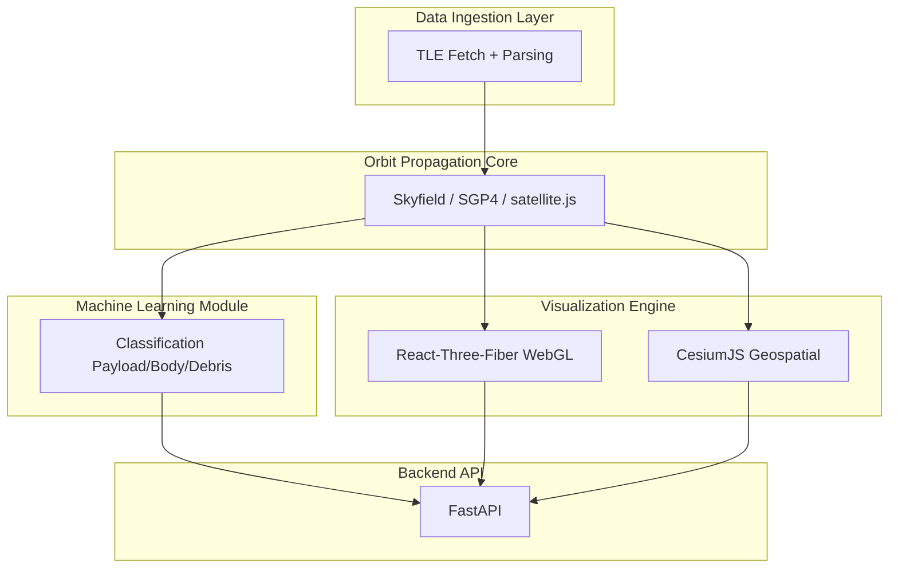

# ORCAS (Orbital Risk and Conjunction Assessment System)

[](https://opensource.org/licenses/MIT)
[](https://www.python.org/downloads/)
[](https://github.com/psf/black)

An enterprise-grade WebGL application and Python backend designed to track near-Earth objects, simulate orbital mechanics, and predict satellite conjunctions using Machine Learning. This system bypasses standard deterministic distance calculations in favor of probability-based state vector analysis, providing a realistic, real-time visualization of the Kessler Syndrome and orbital congestion.

Designed with a research-style scientific structure inspired by modern Space Situational Awareness (SSA) practices.

## Table of Contents

- [Overview](#overview)
- [Scientific Motivation](#scientific-motivation)
- [Key Features](#key-features)
- [System Architecture](#system-architecture)
- [Project Structure](#project-structure)
- [Installation](#installation)
- [Configuration](#configuration)
- [Running the Project](#running-the-project)
- [Presentation and Demo Flow](#presentation-and-demo-flow)
- [Research and Export](#research-and-export)
- [Usage Examples](#usage-examples)
- [Machine Learning Component](#machine-learning-component)
- [Technologies Used](#technologies-used)
- [Roadmap](#roadmap)
- [Testing](#testing)
- [Contributing](#contributing)
- [References](#references)
- [Acknowledgements](#acknowledgements)
- [License](#license)

## Overview

The ORCAS is a modular Python-based toolkit capable of:

- Fetching and parsing real orbital datasets such as TLEs
- Propagating satellite and debris orbits
- Classifying objects using ML models
- Producing 3D visualizations of Earth and orbital tracks
- Exposing a backend API for dashboards and external applications

Although developed within an engineering context, the design style aligns closely with scientific computing and astrophysics toolkits.

## Scientific Motivation

The density of space debris continues to increase due to:

- Large satellite deployments
- Fragmentation events
- Retired spacecraft
- Rocket bodies left in orbit

This creates measurable risks including:

- Collision cascades (Kessler Syndrome)
- Threats to commercial and scientific missions
- Difficulty in long-term orbital sustainability

The purpose of this project is to explore computational astrodynamics, machine learning, and visualization techniques that help understand and model orbital environments at an academic level.

## Key Features

- **Real-Time SGP4 Propagation**: Calculates dynamic ECI-to-Geodetic coordinates at 60 FPS using live Two-Line Element (TLE) data from CelesTrak.
- **ML Conjunction Explainability**: Evaluates Probability of Collision (Pc) and covariance intersection matrices in real-time, visualized through a NASA-inspired telemetry H.U.D.
- **Historical Replay Engine**: A time-decoupled simulation mode that accurately reconstructs the 2009 Iridium-33 and Cosmos-2251 hypervelocity collision using historical TLEs.
- **Kessler Syndrome Swarm**: GPU-accelerated rendering of 10,000+ untracked micro-debris fragments utilizing `THREE.InstancedMesh` for single-draw-call performance.
- **Volumetric Density Heatmaps**: Additive-blending shaders projecting traffic congestion risk zones across LEO, MEO, and GEO.
- **Data Exporter**: Native `.csv` generation for 90-minute forward-projected time-series extraction and academic research validation.
- **Orbital Data Ingestion**: Support for TLE sources such as CelesTrak, with parsing and validation utilities.
- **Machine Learning Classification**: Pretrained scikit-learn models for classifying objects into payload, rocket body, and debris.
- **3D Earth and Orbit Visualization**: High-fidelity React-Three-Fiber WebGL renderer with GMST-synchronized Earth rotation, or PyVista for static analysis.
- **REST API Backend**: FastAPI-powered backend enabling external access to propagation, classification, and data services.
- **Extensible Modular Design**: Organized into clear layers: orbit mechanics, ML, visualization, and API.

## System Architecture

- **Backend Environment**: Python 3.10+, FastAPI, Skyfield, Uvicorn
- **Frontend 1 (High-Fidelity 3D)**: React, React-Three-Fiber, Three.js, satellite.js
- **Frontend 2 (Geospatial Base)**: React, CesiumJS, Resium

**Hardware Target**: Optimized for modern discrete hardware. Sustained 60 FPS under full particle load validated on NVIDIA GeForce RTX 5060 / AMD Ryzen 9 architecture.



## Project Structure

```text
orcas/
├─ pyproject.toml              # Project metadata and dependencies (Python 3.11)
├─ requirements.txt            # Pinned dependencies
├─ README.md                   # You are here
│
├─ frontend-three/             # PRIMARY: React-Three-Fiber WebGL frontend
│  ├─ package.json
│  ├─ vite.config.js
│  ├─ public/
│  │  └─ textures/             # Earth day map, cloud layers
│  └─ src/
│     └─ App.jsx               # Main application (all 3D, UI, ML logic)
│
├─ frontend/                   # ALTERNATIVE: CesiumJS geospatial frontend
│  ├─ package.json
│  ├─ vite.config.js
│  └─ src/
│     └─ App.jsx               # Cesium globe and entity rendering
│
├─ backend/
│  ├─ .env                     # NASA API key, config (not committed)
│  ├─ __init__.py              # Makes backend a package
│  ├─ api.py                   # FastAPI satellite data endpoint
│  ├─ main.py                  # Main entry: python -m backend.main
│  ├─ build_dataset.py         # Build CSV dataset from TLEs
│  ├─ collision_checker.py     # Close-approach detection (cKDTree)
│  ├─ config.py                # Central config
│  ├─ nasa_client.py           # NASA API access helpers
│  ├─ orbit_plotter.py         # 3D PyVista orbit visualization
│  ├─ orbit_predictor.py       # Time-step prediction from TLE
│  ├─ tle_fetcher.py           # Fetches and stores TLE files
│  ├─ train_model.py           # Trains ML classifier
│  ├─ utils.py                 # Common utilities
│  └─ visualizer.py            # 2D Cartopy visualizations
│
├─ assets/
│  ├─ models/                  # 3D models (Earth, ISS, Hubble)
│  └─ textures/                # Earth textures, cloud maps
│
├─ data/
│  ├─ latest_tle.txt           # Last downloaded TLE snapshot
│  ├─ tle_features_all.csv     # Extracted features for many objects
│  ├─ tle_features_labeled.csv # Labeled feature dataset (for ML)
│  ├─ famous_tles/             # TLEs for selected famous satellites
│  └─ tle/active/              # Historical TLE snapshots
│
├─ ml_models/
│  └─ object_classifier.joblib # Trained RandomForest classifier
│
├─ tests/
│  ├─ sample.tle
│  ├─ test_orbit_predictor.py  # Unit tests for orbit time-steps
│  └─ test_time_steps.py       # Additional time-step logic tests
│
└─ tools/
   └─ fix_backend_imports.py   # Helper script for import path cleanup
```

## Installation

### Clone the Repository

```bash
git clone https://github.com/fenilmodi823/orcas.git
cd orcas
```

### Create a Virtual Environment

```bash
python -m venv .venv
```

**Activate:**

- Windows:

  ```powershell
  .venv\Scripts\activate
  ```

- Linux/macOS:

  ```bash
  source .venv/bin/activate
  ```

### Install Dependencies

```bash
pip install --upgrade pip
pip install -r requirements.txt
```

## Configuration

Create a `.env` file based on `.env.example`.

**Example:**

```ini
NASA_API_KEY=your_api_key_here
DATA_SOURCE_URL=https://celestrak.org/NORAD/elements/gp.php?CATNR=
LOG_LEVEL=INFO
```

## Running the Project

This project uses a decoupled architecture. You must run the Python data API alongside your chosen frontend client.

### Step 1 - Start the Python Backend (FastAPI)

The backend fetches, filters, and standardizes TLE payloads from CelesTrak.

```bash
cd backend
python -m venv venv
```

Activate the virtual environment:

- Windows:

  ```powershell
  venv\Scripts\activate
  ```

- Linux/macOS:

  ```bash
  source venv/bin/activate
  ```

Then install dependencies and start the server:

```bash
pip install -r requirements.txt
uvicorn api:app --reload
```

The API will be live at `http://localhost:8000`

- Swagger UI: [http://127.0.0.1:8000/docs](http://127.0.0.1:8000/docs)
- ReDoc: [http://127.0.0.1:8000/redoc](http://127.0.0.1:8000/redoc)

### Step 2 - Start a Frontend

#### Option A - Three.js Frontend (Primary, Recommended)

This is the highly optimized, custom WebGL interface featuring the ML Dashboards, Kessler Swarm, Density Heatmaps, Historical Replay, and CSV Data Export.

```bash
uvicorn backend.api:app --reload --port 8000
cd frontend-three
npm install
npm run dev
```

The application will be live at `http://localhost:5173`

#### Option B - CesiumJS Frontend (Alternative Geospatial View)

This is the secondary frontend leveraging the CesiumJS engine for highly accurate planetary terrain mapping.

```bash
cd frontend
npm install
npm run dev
```

The application will be live at `http://localhost:5174`

## Presentation and Demo Flow

To demonstrate the system's capabilities during an academic or technical review, follow this interaction path:

1. **Live Tracking**: Use the Top-Left search node to isolate the ISS (ZARYA) and observe the real-time Geodetic telemetry in the Bottom-Right Intelligence Hub.
2. **Threat Assessment**: Toggle the **SHOW KESSLER SWARM** and **DENSITY HEATMAP** to visualize orbital congestion.
3. **ML Prediction**: Click **RUN ML PREDICTION** to trigger the automated conjunction sequence, switching the UI into Critical override mode to view intersection vectors.
4. **Historical Validation**: Click **2009 IRIDIUM COLLISION** to reset the physics engine to historical parameters, proving the underlying kinematics.
5. **Data Export**: Select any tracked object and click **EXPORT DATA (CSV)** to download the 90-minute forward projection.

## Research and Export

For data analysis, select any tracked object and click **EXPORT DATA (CSV)** in the Intelligence Hub. The engine will project the satellite's kinematic state 90 minutes into the future and download the raw time-series data for use in Pandas, Matplotlib, or Excel.

The exported CSV contains the following columns:

| Column | Description |
| --- | --- |
| Time_Offset_Min | Minutes from current simulation time |
| UTC_Time | ISO 8601 timestamp |
| Latitude | Geodetic latitude in degrees |
| Longitude | Geodetic longitude in degrees |
| Altitude_km | Height above WGS84 ellipsoid |
| Velocity_km_s | Resultant velocity magnitude |

## Usage Examples

### Propagate an Object

```bash
curl "http://127.0.0.1:8000/propagate?norad_id=25544&minutes=120"
```

### Python Orbit Propagation

```python
from backend.orbit.propagation import propagate_tle
from datetime import datetime, timedelta

positions = propagate_tle(tle_line1, tle_line2, datetime.utcnow(), datetime.utcnow() + timedelta(minutes=90))
for t, (x,y,z) in positions:
    print(t, x, y, z)
```

### Classify an Object

```python
from backend.ml.classifier import classify_object

features = {
    "semi_major_axis": 6780.0,
    "eccentricity": 0.0005,
    "inclination": 51.6,
    "period_minutes": 92.6
}

print(classify_object(features))
```

## Machine Learning Component

- **Model Type**: Decision Tree / Random Forest (scikit-learn)
- **Predicted Classes**:
  - Payload
  - Rocket Body
  - Debris
- **Feature Set Examples**:
  - Semi-major axis
  - Eccentricity
  - Inclination
  - Orbital period
  - Derived orbital parameters
- **Training Pipeline**:
    1. Data preprocessing
    2. Feature extraction
    3. Model training
    4. Model serialization with joblib

## Technologies Used

- **Python 3.10+** with FastAPI and Uvicorn
- **Skyfield / SGP4** for orbit propagation
- **scikit-learn** for ML classification
- **NumPy, pandas** for numerical computing
- **PyVista, Matplotlib** for static visualization
- **React 18** with Vite build tooling
- **React-Three-Fiber / Three.js** for real-time 3D WebGL rendering
- **satellite.js** for client-side SGP4 propagation at 60 FPS
- **CesiumJS / Resium** for geospatial terrain rendering
- **react-select** for searchable satellite dropdown
- **pytest** for backend tests

## Roadmap

- [ ] Add J2 and atmospheric drag perturbation models
- [x] Add conjunction (collision risk) prediction
- [ ] Add orbital decay prediction using ML
- [x] Enhance 3D Earth rendering (NASA Eyes style)
- [x] Build full React.js dashboard
- [x] Historical collision replay (2009 Iridium-Cosmos)
- [x] Kessler Syndrome debris swarm visualization
- [x] Volumetric orbital density heatmaps
- [x] Telemetry CSV data exporter
- [ ] Dynamic collision integration with backend collision checker
- [ ] Add Docker-based deployment
- [ ] Package as a pip-installable module

## Testing

Run tests using:

```bash
pytest
```

## Contributing

1. Follow PEP 8.
2. Add docstrings for all public modules and functions.
3. Write tests for new features.
4. Use meaningful commit messages.
5. Keep modules logically separated (orbit, ML, API, viz).

## Data Sources

- **CelesTrak**: Primary source for Two-Line Element sets (TLEs).
- **Space-Track.org**: Official source for space situational awareness data (requires account).

## References

1. Vallado, D. A. *Fundamentals of Astrodynamics and Applications*.
2. [NASA Orbital Debris Program Office](https://orbitaldebris.jsc.nasa.gov)
3. [CelesTrak TLE Catalog](https://celestrak.org)
4. [ESA Space Situational Awareness Programme](https://www.esa.int/About_Us/ESAC/Space_Situational_Awareness_-_SSA)
5. [scikit-learn Documentation](https://scikit-learn.org)
6. [Skyfield Documentation](https://rhodesmill.org/skyfield)
7. [PyVista Documentation](https://docs.pyvista.org)

## Acknowledgements

Developed as an academic capstone project exploring:

- Orbital mechanics and SGP4 propagation
- Space debris studies and the Kessler Syndrome
- Machine learning for conjunction assessment
- Real-time 3D scientific visualization with WebGL

The structure and documentation style follow conventions used in astrophysics and space-science computational tools.

## License

This project is licensed under the MIT License - see the [LICENSE](LICENSE) file for details.
